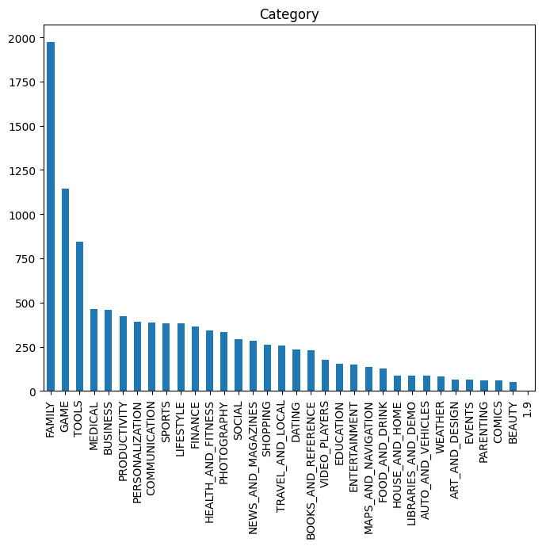
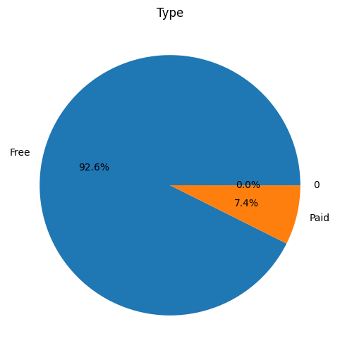
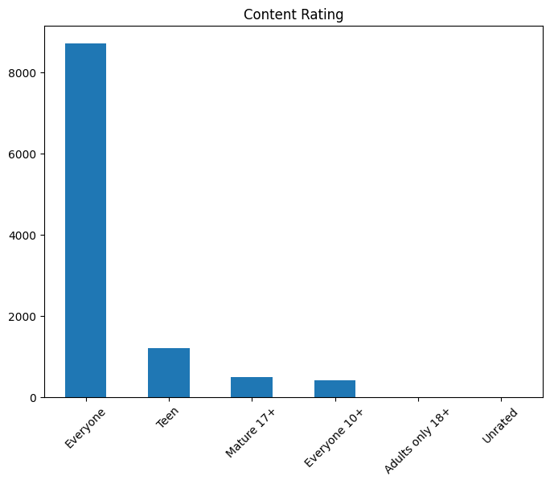
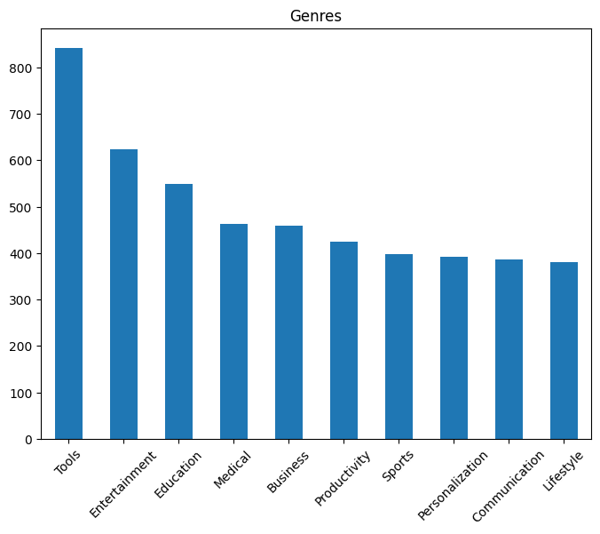
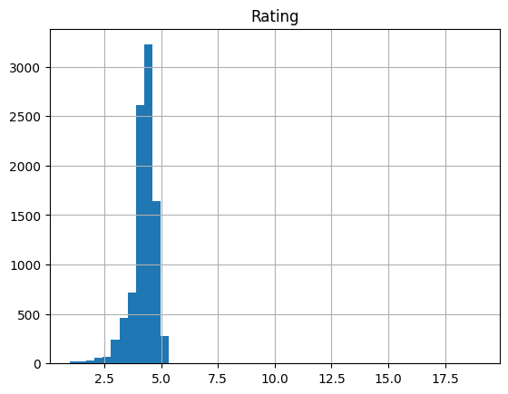
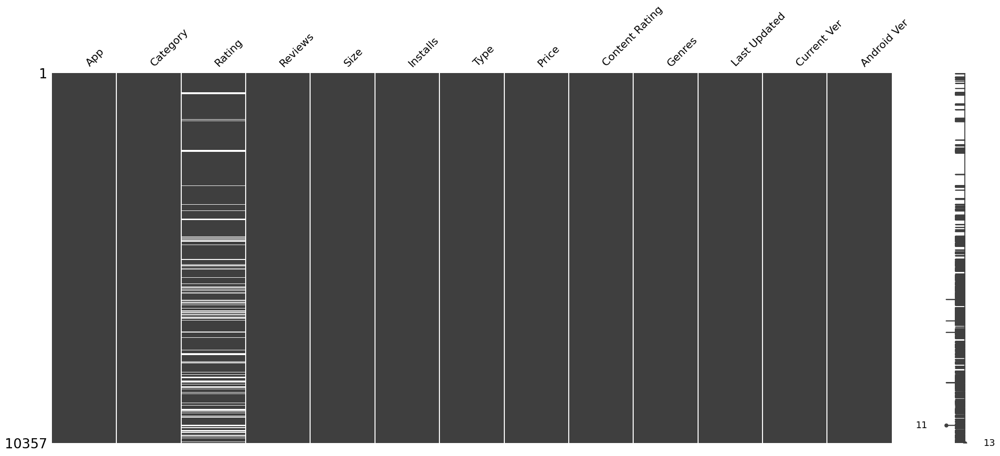

# Laporan Proyek Machine Learning - Muhammad Fadhil Abyansyah

## Domain Proyek

_Google Play Store_ adalah destinasi utama bagi pengguna yang mencari beragam konten digital. Setiap hari, toko ini diperbarui dengan berbagai aplikasi baru yang dikembangkan oleh para pengembang, memberikan pengguna lebih banyak opsi [[1](https://doi.org/10.1109/TSE.2016.2630689)]. Meskipun memberikan keuntungan karena adanya variasi yang luas, namun kebingungan pengguna dalam memilih aplikasi yang sesuai dengan kebutuhan pengguna merupakan masalah yang perlu diatasi. Maka dari itu, dibutuhkan sistem rekomendasi untuk aplikasi yang dapat merekomendasikan aplikasi yang sesuai dengan minat pengguna berdasarkan aplikasi yang telah diunduh atau digunakan oleh pengguna tersebut.

Sistem rekomendasi adalah sistem yang memberi saran item kepada pengguna dan memudahkan pengambilan keputusan [[2](https://doi.org/10.1609/aimag.v32i3.2361)]. Dalam konteks _Google Play Store_, sistem ini bermanfaat karena membantu pengguna menemukan aplikasi serupa dengan yang sudah mereka unduh sebelumnya, seperti dalam _genre_ atau _tipe_ yang sama [[3](https://doi.org/10.1109/ITCE.2019.8646645)].

## Business Understanding

Pengembangan sistem rekomendasi aplikasi memiliki potensi signifikan dalam meningkatkan pengalaman pengguna di _Google Play Store_ dengan memberikan bantuan dalam pengambilan keputusan instalasi aplikasi. Dari perspektif bisnis, hal ini dapat meningkatkan retensi pengguna dan menghasilkan pendapatan yang lebih tinggi melalui peningkatan jumlah unduhan aplikasi yang direkomendasikan. Secara ekonomi, dengan meningkatnya jumlah instalasi aplikasi, _platform_ _Google Play Store_ dapat menarik lebih banyak pengiklan, yang pada gilirannya akan meningkatkan pendapatan iklan. Hal ini juga dapat memperkuat posisi _Google Play Store_ sebagai tujuan utama bagi pengembang aplikasi, memperluas ekosistem aplikasi, dan memperkuat ikatan dengan pengguna. Dari perspektif perusahaan dan _stakeholder_, implementasi sistem rekomendasi ini dapat meningkatkan kepuasan pengguna, memperkuat citra merek _Google Play Store_, dan meningkatkan loyalitas pengguna, yang semuanya penting untuk pertumbuhan jangka panjang dan keberhasilan perusahaan.

### Problem Statements

- Bagaimana eksplorasi dataset untuk identifikasi karakteristiknya dan pemilihan fitur untuk pengembangan model?
- Bagaimana evaluasi adanya data duplikat dan _missing_ pada tahap _data assesing_, dan mengambil tindakan yang sesuai?
- Bagaimana membersihkan data melalui tindakan _dropping_ atau _imputation_ untuk memastikan kelayakan penggunaan dalam pengembangan model?
- Bagaimana persiapan data seperti _vectorizing_ dan data _splitting_ sebelum pembuatan model?
- Bagaimana pembuatan model sistem rekomendasi menggunakan metode _Cosine Similarity_ dan _K-Nearest Neighbor_ berdasarkan fitur yang dipilih?
- Bagaimana pengukuran kinerja model sistem rekomendasi menggunakan metrik evaluasi yang tepat?

### Goals

- Mengeksplorasi informasi dataset dan melihat fitur yang paling memungkinkan dipilih untuk pengembangan model
- Mengevaluasi keberadaan duplikat dan nilai yang hilang dalam dataset.
- Membersihkan data dengan langkah-langkah yang sesuai untuk mempersiapkannya untuk pengembangan model.
- Mempersiapkan data dengan proses vektorisasi dan pembagian data sebelum model dibuat.
- Membangun model sistem rekomendasi menggunakan metode _Cosine Similarity_ dan _K-Nearest Neighbor_ berdasarkan fitur yang telah dipilih.
- Mengevaluasi kinerja model sistem rekomendasi menggunakan metrik evaluasi yang tepat.

### Solution statements

- Dalam eksplorasi fitur-fitur untuk mengetahui sebaran fitur tertentu dalam _dataset_. Teknik yang digunakan yaitu visualiasi data menggunakan _bar plot_ dan _histogram_ dari fitur yang dipilih.
- Dalam mencapai model prediksi yang baik dilakukan proses data wrangling yang mencakup pengumpulan data, penilaian data, dan pembersihan data. Pengumpulan data melibatkan pengambilan data dan menyimpannya dalam kerangka data. Penilaian data mencakup deteksi _outlier_ (data yang signifikan berbeda dari sebagian besar data lainnya), Duplikasi data (data yang mirip dengan data lain), dan nilai yang hilang. Sedangkan pembersihan data adalah tindakan yang dilakukan berdasarkan hasil penilaian data. Tindakan yang dapat diambil dalam pembersihan data untuk mengatasi duplikasi dan nilai yang hilang adalah dengan menghapus baris data yang memiliki duplikasi atau nilai yang hilang.
- Dalam mengevaluasi kinerja model, dilakukan pengecekan menggunakan metrik evaluasi seperti presisi, _calinski harabasz score_, dan _davies bouldin score_.

## Data Understanding

Data yang digunakan dalam pembuatan model merupakan data sekunder. Data diambil dari [Kaggle](https://www.kaggle.com) dengan nama _dataset_ yaitu [Google Play Store Apps](https://www.kaggle.com/datasets/lava18/google-play-store-apps). Berikut merupakan detail dari _dataset_ yang digunakan untuk pembuatan model:

- _Dataset_ berupa CSV
- _Dataset_ terdiri dari 10841 _records_ dengan 13 kolom yaitu: _App_, _Category_, _Rating_, _Reviews_, _Size_, _Installs_, _Type_, _Price_, _Content_, _Genres_, _Last Updated_, _Current Ver_, dan _Android Ver_.
- _Dataset_ terdiri dari 12 data kategori dan 1 data numerik.
- _Dataset_ terdapat sejumlah nilai yang hilang di beberapa kolom, yakni 1474 pada _Rating_, 1 pada _Type_ dan _Content Rating_ masing-masing, serta 8 pada _Current Ver_ dan 3 pada _Android Ver_.

### Variabel-variabel pada Google Play Store dataset adalah sebagai berikut:

- _App_ merupakan nama aplikasi
- _Category_ merupakan kategori aplikasi
- _Rating_ merupakan penilaian pengguna dari aplikasi (dalam satuan bintang 1-5)
- _Reviews_ merupakan jumlah pengguna yang memberikan ulasan pada aplikasi tersebut (dalam satuan buah)
- _Size_ merupakan ukuran dari aplikasi (dalam satuan byte)
- _Installs_ merupakan jumlah pengguna yang meng-install aplikasi
- _Type_ merupakan tipe aplikasi (dalam kategori Paid/berbayar atau Free/gratis)
- _Price_ merupakan harga dari aplikasi (dalam satuan dollar USD)
- _Content Rating_ merupakan kategori usia penggunaan untuk aplikasi (Everyone, Mature 17+, dst)
- _Genres_ merupakan kategori dari genre aplikasi (Medical, Lifestyle, dst)
- _Last Updated_ merupakan tanggal terakhir aplikasi di perbaharui oleh pengembang aplikasi
- _Current Ver_ merupakan versi terkini dari aplikasi
- _Android Ver_ merupakan versi android minimum yang dipersyaratkan untuk meng-install aplikasi

### Eksplorasi Data

- Eksplorasi dataset. Berdasarkan _output_ yang dihasilkan terdapat 12 kolom data kategori dengan _tipe object_ seperti _App_, _Category_, _Reviews_, _Size_, _Installs_, _Type_, _Price_, _Content Rating_, _Genres_, _Last Updated_, _Current Ver_, dan _Android Ver_. Terdapat 1 kolom numerik dengan tipe data _float64_ seperti _Rating_.
- Cek jumlah baris dan kolom.
- Mengubah kolom Content Rating menjadi Content_Rating.
- Cek jumlah entri unik berdasarkan _App_, _Category_, _Rating_, _Type_, _Content Rating_, dan _Genres_ menggunakan fungsi unique(). Dalam proyek ini, hanya fokus pada fitur-fitur utama seperti _App_, _Category_, dan _Rating_ untuk membuat model sistem rekomendasi yang lebih sederhana. Untuk model _Content Based Filtering_, menggunakan data _App_, _Category_, _Type_, _Content Rating_, dan _Genres_ . Sedangkan untuk _Collaborative Filtering,_ menggunakan data _App_ dan _Rating_.
- Membagi fitur pada dataset menjadi dua bagian, yaitu data kategori dan data numerik.
<p>
  
</p>

Gambar 1 Visualisasi Data _Category_

Berdasarkan Gambar 1, dapat dilihat bahwa distribusi data _'Category'_ memiliki perbandingan jumlah yang tidak sama, dengan tiga _'Category'_ yang paling banyak yaitu: _FAMILY_ sebanyak 1972 sampel dengan persentase 18.2%, _GAME_ sebanyak 1144 sampel dengan persentase 10.6%, dan _TOOLS_ sebanyak 843 sampel dengan persentase 7.8%. Hal ini mengindikasikan bahwa aplikasi dengan kategori _'FAMILY'_ memiliki representasi paling banyak dalam _dataset_, diikuti oleh _'GAME'_ dan _'TOOLS'_.

<p>
  
</p>

Gambar 2 Visualisasi Data _Type_

Berdasarkan Gambar 2, dapat dilihat bahwa distribusi data _'Type'_ memiliki perbandingan jumlah yang tidak sama, dengan _'Type'_ yang paling banyak yaitu: _Free_ sebanyak 10039 sampel dengan persentase 92.6%, _Paid_ sebanyak 800 sampel dengan persentase 7.4%, dan _0_ sebanyak 1 sampel dengan persentase 0%. Hal ini mengindikasikan bahwa aplikasi dengan kategori _'Free'_ memiliki representasi paling banyak dalam _dataset_, diikuti oleh _'Paid'_ dan _'0'_.

<p>
  
</p>

Gambar 3 Visualisasi Data _Content Rating_

Berdasarkan Gambar 3, dapat dilihat bahwa distribusi data _'Content Rating'_ memiliki perbandingan jumlah yang tidak sama, dengan tiga _'Content Rating'_ yang paling banyak yaitu: _Everyone_ sebanyak 8714 sampel dengan persentase 80.4%, _Teen_ sebanyak 1208 sampel dengan persentase 11.1%, dan _Mature 17+_ sebanyak 499 sampel dengan persentase 4.6%. Hal ini mengindikasikan bahwa aplikasi dengan kategori _'Everyone'_ memiliki representasi paling banyak dalam _dataset_, diikuti oleh _'Teen'_ dan _'Mature 17+'_.

<p>
  
</p>

Gambar 4 Visualisasi Data _Genres_

Berdasarkan Gambar 4, dapat dilihat bahwa distribusi data _'Genres'_ memiliki perbandingan jumlah yang tidak sama, dengan tiga _'Genres'_ yang paling banyak yaitu: _Tools_ sebanyak 842 sampel dengan persentase 7.8%, _Entertainment_ sebanyak 623 sampel dengan persentase 5.7%, dan _Education_ sebanyak 549 sampel dengan persentase 5.1%. Hal ini mengindikasikan bahwa aplikasi dengan kategori _'Tools'_ memiliki representasi paling banyak dalam _dataset_, diikuti oleh _'Entertainment'_ dan _'Education'_.

<p>
  
</p>

Gambar 5 Visualisasi Data _Rating_

Berdasarkan Gambar 5, dapat dilihat mayoritas data _'Rating'_ berada pada _score_ 4, namun tampak bahwa visualisasi ini menampilkan rentang skor yang luas yaitu 0 sampai dengan sekitar 20. Hal ini menyoroti variasi besar dalam skor penilaian aplikasi, dengan sebagian besar aplikasi memiliki _rating_ yang cukup tinggi, tetapi juga ada beberapa yang mendapat _rating_ rendah atau sangat tinggi. Hal ini dapat memberikan wawasan tentang distribusi keseluruhan dari penilaian pengguna terhadap aplikasi yang disajikan dalam _dataset_ tersebut.

## Data Preparation

Pada tahap data preparation, terdapat beberapa kegiatan seperti data _gathering_, data _assessing_, dan data _cleaning_. Data _gathering_ dilakukan dengan mengimpor data ke dalam _dataframe_ agar dapat diolah dengan baik.

Pada tahap data _assessing_, beberapa pengecekan yang dilakukan mencakup:

- Mendeteksi _outlier_, yaitu data yang signifikan berbeda dari mayoritas data lainnya. Proses yang dilakukan yaitu mengecek _outlier_ dengan _box plot_, mengecek _unique_ data untuk melihat keberadaan _outlier_, menampilkan data _outlier_, menghapus 1 data _outlier_ jika outlier dianggap sebagai data yang tidak relevan.
- Memeriksa duplikasi data, yaitu data yang sama dengan data lain dalam _dataset_. Data duplikat yang ditemukan sebesar 483 data. Selanjutnya, Setelah data duplikat diidentifikasi, langkah selanjutnya adalah menghapusnya dari dataset. Hal ini dilakukan untuk mencegah redundansi dan memastikan integritas data.
- Mengidentifikasi nilai yang hilang, yaitu data atau informasi yang tidak lengkap atau tidak tersedia.

Dalam tahap data _cleaning_, terdapat tiga metode utama yang dapat diterapkan:

- _Dropping_ (metode yang dilakukan dengan cara menghapus sejumlah baris data)
- _Imputation_ (metode yang dilakukan dengan cara mengganti nilai yang "hilang" atau tidak tersedia dengan nilai tertentu yang bisa berupa median atau mean dari data)
- _Interpolation_ (metode menghasilkan titik-titik data baru dalam suatu jangkauan dari suatu data)

<p>
  
</p>

Gambar 6 Visualisasi _Matrix_

Pada Gambar 6 menunjukkan bahwa terdapat data yang belum lengkap berdasarkan visualisasi matriks.

Untuk mengatasi _outlier_, data duplikat, dan nilai yang hilang dalam proyek ini menggunakan metode _dropping_ dengan fungsi drop(). Fungsi drop() digunakan untuk menghapus baris yang mengandung _outlier_, data duplikat, dan nilai yang hilang dari _dataset_. Setelah penerapan metode ini, _dataset_ menjadi bersih. Terlihat dari hasil info() yang menunjukkan bahwa _Non-Null Count_ memberikan nilai yang sama untuk semua fitur dalam _dataset_. Tidak ada lagi _outlier_, data duplikat, atau data yang hilang. Dengan demikian, _dataset_ siap untuk diproses lebih lanjut dalam pembuatan sistem rekomendasi.

## Modeling

Model yang digunakan adalah _Cosine Similarity_ dan _K-Nearest Neighbor_. Model-model tersebut digunakan karena mampu membantu melihat kemiripan antar data.

- #### _Cosine Similarity_

_Cosine Similarity_ adalah sebuah metode untuk mengukur sejauh mana dua vektor menunjuk ke arah yang sama dalam ruang berdimensi banyak. Ini berguna dalam mengevaluasi kesamaan antara dua dokumen atau item berbasis teks. Konsep ini diilustrasikan dengan menghitung sudut kosinus antara dua vektor, di mana semakin kecil sudutnya, semakin besar nilai _Cosine Similarity_-nya. Rumus _Cosine Similarity_ dapat disederhanakan sebagai berikut:

$$ Cosine Similarity (A, B) = (A · B) / (||A|| \* ||B||) $$

- (A·B) menyatakan produk titik dari vektor A dan B.
- ||A|| mewakili norma _Euclidean_ (magnitudo) dari vektor A.
- ||B|| mewakili norma _Euclidean_ (magnitudo) dari vektor B.

Untuk melakukan pengujian model, digunakan potongan kode berikut.

```
app_recommendations('EF Spelling Bee')
```

Tabel 1a. Hasil Pengujian Model _Content Based Filtering Genres_

|     | App                          | Genres    |
| --- | ---------------------------- | --------- |
| 0   | Timetable                    | Education |
| 1   | British Columbia License     | Education |
| 2   | Starfall Free & Member       | Education |
| 3   | AP Calculus BC Practice Test | Education |
| 4   | Wifi BT Scanner              | Education |

Tabel 1b. Hasil Pengujian Model _Content Based Filtering Type_

|     | App                          | Type |
| --- | ---------------------------- | ---- |
| 0   | Timetable                    | Free |
| 1   | British Columbia License     | Free |
| 2   | Starfall Free & Member       | Free |
| 3   | AP Calculus BC Practice Test | Free |
| 4   | Wifi BT Scanner              | Free |

Tabel 1c. Hasil Pengujian Model _Content Based Filtering Rating_

|     | App                          | Content Rating |
| --- | ---------------------------- | -------------- |
| 0   | Timetable                    | Everyone       |
| 1   | British Columbia License     | Everyone       |
| 2   | Starfall Free & Member       | Everyone       |
| 3   | AP Calculus BC Practice Test | Everyone       |
| 4   | Wifi BT Scanner              | Everyone       |

Berdasarkan pengujian model pada Tabel 1a, 1b, dan 1c, dapat dilihat contoh konkret bagaimana model _Cosine Similarity_ memberikan rekomendasi aplikasi berdasarkan fitur-fitur dipilih pada model. Adapun fitur yang dipilih pada model yang dibuat adalah _'App'_ terhadap _'Genres'_, _'App'_ terhadap _'Type'_, dan _'App'_ terhadap _'Content Rating'_. Dari contoh pengujian dapat dilihat contoh konkret bagaimana model _Cosine Similarity_ memberikan rekomendasi aplikasi yang sejenis dengan _'EF Spelling Bee'_ dengan fitur _'Genres'_, _'Type'_, dan _'Content Rating'_ yang mirip dengan aplikasi _'EF Spelling Bee'_ yaitu dengan _Genres_: _Education_, _Type_: _Free_ dan _Content Rating_: _Everyone_. Hasil rekomendasi menampilkan 5 buah aplikasi dengan _Genres_: _Education_, _Type_: _Free_ dan _Content Rating_: _Everyone_ yang serupa dengan* 'EF Spelling Bee'*. Tentunya sistem rekomendasi ini sangat membantu pengguna mencari aplikasi yang sejenis.

Kelebihan:

- Kompleksitasnya yang rendah.
- Tidak dipengaruhi oleh skala.
- Tidak sensitif terhadap panjang vektor.

Kekurangan:

- Besarnya vektor tidak diperhitungkan, hanya arahnya saja.
- Bergantung pada kualitas representasi vektor.
- Tidak cocok untuk nlai negatif.

- #### _K-Nearest Neighbor_

_K-Nearest Neighbor_ (KNN) merupakan algoritma yang paling sederhana dalam mengkelompokkan. Metode ini mudah dipahami dibandingkan metode lain karena mengkelompokkan berdasarkan jarak terdekat dengan objek lainnya (tetangga). K dalam KNN merupakan variabel jumlah tetangga terdekat yang akan diambil untuk proses klasifikasi. Jumlah K=1 akan membuat hasil klasifikasi terasa kalu karena hanya memperhitungkan satu tetangga terdekat atau satu _record_ karakteristik data terdekat. Pada proyek ini dibuat model KNN dengan menggunakan _Euclidean Distance_. Diberikan titik data P dan kumpulan data D yang berisi beberapa titik data, jarak _Euclidean_ antara P dan setiap titik data di D dihitung menggunakan rumus berikut:

$$ Euclidean Distance (P, Q) = sqrt(∑(Pi - Qi)^2) $$

- Pi mewakili fitur ke-i dari titik data P.
- Qi mewakili fitur ke-i dari titik data Q.
- ∑ merupakan simbol penjumlahan pada semua fitur titik data.

Setelah jarak dihitung, algoritma KNN memilih tetangga terdekat K untuk membuat prediksi untuk titik data baru P.

Berdasarkan pada Tabel 2 di bawah, dapat dilihat contoh konkret bagaimana model _K-Nearest Neighbor_ memberikan rekomendasi aplikasi berdasarkan fitur-fitur yang dipelajari dalam model, yaitu _'App'_ terhadap _'Category'_, _'Rating'_, _'Reviews'_, _'Size'_, _'Installs'_, dan _'Price'_. Hasil rekomendasi untuk aplikasi yang mirip dengan _'Natural Recipes for Your Beauty'_ berdasarkan berdasarkan fitur-fitur yang dipelajari memberikan hasil rekomendasi aplikasi serupa yaitu _'Hush - Beauty for Everyone'_, _'Hairstyles step by step'_, _'Tie - Always be happy'_, _'Girls Hairstyles'_, dan _'Mirror - Zoom & Exposure'_ seperti pada Tabel 2 dengan tingkat kemiripan dalam persentase berturut-turut senilai 100.0%, 99.99%, 99.97%, 99.96%, dan 99.95%. Tentunya model ini akan sangat membantu pengguna menemukan aplikasi yang mirip dengan _'Natural Recipes for Your Beauty'_.

Tabel 2. Hasil Pengujian Model _K-Nearest Neighbor_

|     | App Name                   | Similiarity Score |
| --- | -------------------------- | ----------------- |
| 0   | Hush - Beauty for Everyone | 100.0%            |
| 1   | Hairstyles step by step    | 99.99%            |
| 2   | Tie - Always be happy      | 99.97%            |
| 3   | Girls Hairstyles           | 99.96%            |
| 4   | Mirror - Zoom & Exposure - | 99.95%            |

Kelebihan:

- Pelatihan sangat cepat.
- Sederhana dan mudah dipelajari.
- Tahan terhadap data pelatihan.
- Efektif jika data pelatihan besar.

Kekurangan:

- Nilai k menjadi bias dalam model.
- Komputasi yang kompleks.
- Keterbatasan memori.
- Mudah tertipu dengan atribut yang tidak relevan.

## Evaluation

Untuk mengevaluasi kinerja model, digunakan beberapa metrik evaluasi, yaitu Presisi, Calinski-Harabasz Score, dan Davies-Bouldin Score.

- Presisi: Metrik ini mengukur rasio prediksi positif sejati terhadap jumlah total prediksi positif, termasuk positif sejati dan positif palsu. Presisi digunakan khususnya untuk mengevaluasi kinerja model pengelompokan.
- Calinski-Harabasz Score: Metrik ini digunakan untuk menilai kualitas algoritma pengelompokan dengan mengukur rasio dispersi antar-_cluster_ dengan dispersi dalam-_cluster_. Skor yang lebih tinggi menandakan bahwa _cluster_ lebih terdefinisi dengan baik.
- Davies-Bouldin Score: Metrik ini juga digunakan untuk mengevaluasi kualitas algoritma pengelompokan. Metrik ini menghitung kesamaan rata-rata antara setiap _cluster_ dan _cluster_ yang paling mirip, sambil juga mempenalti _cluster_ yang terlalu dekat satu sama lain.

Berikut merupakan rumus dari masing-masing metrik yang digunakan:

$$ Precision = TP / (TP + FP) $$

$$ Calinski-Harabasz Score = (BSS / WSS) \* (n - k) / (k - 1) $$

$$ Davies-Bouldin Score = (1 / k) \* Σ(max((Ri + Rj) / d(Ci, Cj))) $$

- TP (_True Positives_) merupakan jumlah kejadian positif yang diprediksi dengan benar.
- FP (_False Positives_) merupakan jumlah kejadian positif yang diprediksi salah.
- BSS (_Between Sum of Squares_) merupakan jumlah kuadrat jarak antara centroid _cluster_ dan rata-rata keseluruhan.
- WSS (Dalam Jumlah Kuadrat) merupakan jumlah jarak kuadrat antara titik data dan pusat _cluster_ masing-masing.
- n merupakan jumlah total titik data.
- k merupakan jumlah _cluster_.
- Ri merupakan jarak rata-rata antara setiap titik data di _cluster_ i dan centroid _cluster_ i.
- Rj merupakan jarak rata-rata antara setiap titik data di _cluster_ j dan pusat massa _cluster_ j.
- d(Ci, Cj) merupakan jarak antara sentroid _cluster_ i dan j.

Hasil presisi berdasarkan Tabel 1a, 1b, dan 1c dapat dilihat bahwasanya besar presisi jika dihitung dengan menggunakan rumusan presisi adalah 5/5 atau 100% untuk model rekomendasi Top-5. Hal ini menunjukkan bahwa model mampu memberikan rekomendasi dengan tingkat presisi yang sangat baik (dalam hal ini 100%). Hal ini sesuai dengan hasil uji dimana model mampu memberikan rekomendasi dengan _Genres_, _Type_, dan _Content Rating_ yang yang mirip dengan aplikasi _'EF Spelling Bee'_ yaitu dengan _Genres_: _Education_, _Type_: _Free_ dan _Content Rating_: _Everyone_. Hasil rekomendasi menampilkan 5 buah aplikasi dengan _Genres_: _Education_, _Type_: _Free_ dan _Content Rating_: _Everyone_ yang serupa dengan _'EF Spelling Bee'_.

Hasil _Calinski-Harabasz Score_ pada model ini adalah bahwa model memberikan skor yang relatif rendah dengan nilai 7.4998974132315315. Hal ini menunjukkan bahwa kluster pada model masih belum terpisahkan dengan baik karena nilai skornya masih cukup rendah. Hal ini memungkinkan adanya rekomendasi pada beberapa aplikasi yang tidak sesuai dengan aplikasi yang disukai pengguna. Pada pengujian model untuk aplikasi yang mirip dengan _'Natural Recipes for Your Beauty'_ memberikan hasil rekomendasi aplikasi serupa yaitu _'Hush - Beauty for Everyone'_, _'Hairstyles step by step'_, _'Tie - Always be happy'_, _'Girls Hairstyles'_, dan _'Mirror - Zoom & Exposure'_. Mengingat _Calinski-Harabasz Score_ yang relatif cukup rendah, maka artinya kluster _'App'_ masih belum terpisahkan dengan sempurna.

Hasil Davies-Bouldin Score pada model ini adalah bahwa model memberikan skor dengan nilai 1.585735926526135. Hasil evaluasi Davies-Bouldin menunjukkan bahwa model ini memiliki skor yang relatif cukup kecil. Hal ini menandakan bahwa model sudah memiliki separasi kluster yang cukup baik. Pada pengujian model untuk aplikasi yang mirip dengan _'Natural Recipes for Your Beauty'_ memberikan hasil rekomendasi aplikasi serupa yaitu _'Hush - Beauty for Everyone'_, _'Hairstyles step by step'_, _'Tie - Always be happy'_, _'Girls Hairstyles'_, dan _'Mirror - Zoom & Exposure'_. Mengingat skor _Davies-Bouldin Score_ yang relatif cukup rendah, dari 5 aplikasi serupa yng ditampilkan oleh model artinya model telah cukup berhasil memisahkan _'App'_ pada kluster yang sesuai sehingga mampu memberikan rekomendasi aplikasi yang mirip dengan yang digunakan pengguna.

Berdasarkan analisis yang dilakukan, dapat disimpulkan bahwa model rekomendasi memiliki tingkat presisi yang sangat baik, terutama dalam hal memberikan rekomendasi aplikasi dengan _genre_, _tipe_, dan _rating_ konten yang mirip dengan aplikasi _'EF Spelling Bee'_. Namun, meskipun tingkat presisinya tinggi, evaluasi menggunakan _Calinski-Harabasz Score_ menunjukkan bahwa kluster pada model masih belum terpisahkan dengan baik, yang dapat mengakibatkan rekomendasi beberapa aplikasi yang tidak sesuai dengan preferensi pengguna. Meskipun demikian, hasil dari _Davies-Bouldin Score_ menunjukkan bahwa model telah berhasil memisahkan kluster aplikasi dengan cukup baik, yang menghasilkan rekomendasi yang lebih sesuai dengan preferensi pengguna, seperti dalam kasus aplikasi _'Natural Recipes for Your Beauty'_. Oleh karena itu, meskipun masih ada ruang untuk perbaikan dalam pemisahan kluster, model ini dapat dianggap berhasil dalam memberikan rekomendasi aplikasi yang mirip dengan preferensi pengguna.

## Referensi:

[1] W. Martin, F. Sarro, Y. Jia, Y. Zhang, and M. Harman, “A survey of app store analysis for software engineering,” IEEE Transactions on Software Engineering, vol. 43, no. 9, pp. 817–847, 2017, doi: 10.1109/TSE.2016.2630689.

[2] Y. Park, “Recommender systems: An overview,” Encyclopedia of E-Business Development and Management in the Global Economy, vol. 3, no. 1997, pp. 1221–1230, 2010, doi: 10.4018/978-1-61520-611-7.ch123.

[3] M. H. Mohamed, M. H. Khafagy, and M. H. Ibrahim, “Recommender Systems Challenges and Solutions Survey,” in 2019 International Conference on Innovative Trends in Computer Engineering (ITCE), IEEE, Feb. 2019, pp. 149–155. doi: 10.1109/ITCE.2019.8646645.
